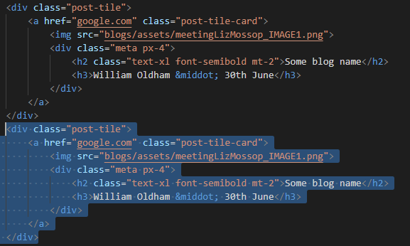

# SoCS SU Reps Web Blog

The SoCS SU Reps Web Blog has been created to provide an open and free space to ask any questions from any of the School Reps or Course Reps. It will be a central repository of comments through the year as well as a guide for further course reps. The content will be created entirely by the course reps and free from any influence of the University of Lincoln SoCS. The aim here is to ensure this space is completely neutral and to help provide the best quality feedback to the SoCS so that as reps we can make this the best school as possible. 

## Overview

This website has been created using mostly basic HTML/CSS/JS. The limited JS used in the site is purely to allow navigation, the FAQ and a few other navigational items work. No tracking, cookies etc are used. 

The reason we wanted to keep the site as simple as possible is to encourage as many contributors as possible who may not yet have experience in open source collaboration, or who may not be familiar with the Git process or web design in general. 

This project hopefully provides a very easy way to start your journey on open source software development using these tools. 

## Feedback Anonymity

Feedback is provided via Google Forms. We have used Google Forms so we have some way to collate feedback without requiring a user to provide any details at all - i.e. all feedback is completely anonymous. As the school and course reps we are then able to review the comments and provide the most constructive feedback to the school. Google Forms works well for this because it provides a feedback results dashboard. However, please note that all Google Form responses and results are viewable by anyone with a '@lincolnsu.com' email address. With this in mind please do not use any names, identifiable or personal details in the feedback.  

## Blog Overview

There are 2 types of content available to be created. These are 'Posts' and 'Blogs'. A post is a small card on the main blog page that links directly to the blog article. Each individual blog is a completely separate web page which allows for a longer form of writing. The posts are separated into months so they are easier to navigate as more blogs are developed. A blog is a long form article and is linked directly from a post. A Blog consist of several paragraphs of text and perhaps multiple images/gifs/videos etc but can be as long as you want. There is no word minimum or maximum. Images are always good though!

**NAMING CONVENTIONS:**

To make it as easy as possible to create a blog please name all your associated files such as images the same name as the blog itself. Please also use `kebab-case` and the naming convention as shown below:

**Blog:**   my-first-30-days.html

**Image:**   my-first-30-days_image1.html (then image2 .. and so on)

Blogs are kept in the `/blogs` folder while images are kept in `/blogs/assets`

This will help separate out content from the website in general and if any images are lost it is easy to find which ones they are.

**NOTES ON IMAGE SIZES:**

To make the formatting of the website as simple as possible there are 2 image sizes used. 

**About Us Images:** 	400px x 400px

**Post Images:** 		450px x 350px

Where possible please try to use these sizes as it helps keep the posts on the main blog page the same size as well as working more evenly across screen sizes.

## Styling - TailwindCSS
This website uses a CSS framework called [tailwindcss](https://tailwindcss.com/) to provide the bulk of the styling. 

The key advantage to this is that the large majority of styling is done through classes directly in the HTML rather than writing CSS files. 

**The below does not need to be done if you are simply adding content!**

Due to this, any changes in styling will require a contributor to have Node.JS installed ([Instructions to install Node.JS](https://docs.npmjs.com/downloading-and-installing-node-js-and-npm)).

When developing and editing any styles, you can run `npm run watch` which will "watch" all HTML and CSS files for any style changes and automatically generate the output CSS for you.

Before committing, please make sure to generate a "production" CSS file by running the respective build command for your OS:
 - Windows: `npm run build-win`
 - Linux: `npm run build-linux`
 - MacOS: `npm run build-macos`

Don't worry about making a mistake! All of this will be checked when you submit a PR 😊

## How to create a new Blog

**STEP 1 - Create The Blog**

- Navigate from your root folder to > blogs
- Duplicate the blank blog template `blank-blog-template.html` and rename
- If you are adding Images please use the `assets` folder that is in the `blogs` folder to hold them
- Open your new blog and update with your new text, images, videos etc. Again, remember to update the href tag for any image links
- When you are finished save the file

**STEP 2 - Add the new blog to the main Blog page**

- Navigate to the main root folder of the project
- Here, you will see a file called `blog.html`. Open it in your text editor of choice
- Under the section called `[month] blogs` (where month is the current month such as `July Blogs`) you will see a list of previous blog posts
- Copy a whole Div section of a single respective post and paste it at the top of the main month section

- Rename the title of the post, the href for the image link and also the source link for the linked blog article itself
- The order of the entries in the month section dictates the order of the posts on the blog page, so newer entries should go to the top

You're all done. If you do have any issues please check the file names as 95% of the problems is due to a simple misspelling etc. Now just make the appropriate pull requests to get the site updated! 9

## How to Contribute

Contributing to the website is easy and we encourage anyone who is interested to make pull requests. 

The general process of contributing on GitHub is widely documented however the outline process is below:

1. Identify where you want to host the project locally. This could be a projects folder for example. 

1. Clone the repository using GitHub desktop or the CLI into this location (CLI is recommended as this helps you become more familiar with Git in general)

1. If you are using a Text editor such as Sublime then the best place to start is by opening the 'index.html' file.

1. To see the website locally you can either drag and drop the 'index.html' file into your browser bar or right click the file and select 'open with [your browser of choice]'.

1. Now make an edit to the index.html file and then refresh your browser to see the edit take effect

## Acknowledgments

This website was built upon the brilliant work of [Garry Clawson](https://github.com/garry-clawson) and all the [previous contributors](https://github.com/socsreps/socsreps.github.io/graphs/contributors) who worked on the project

